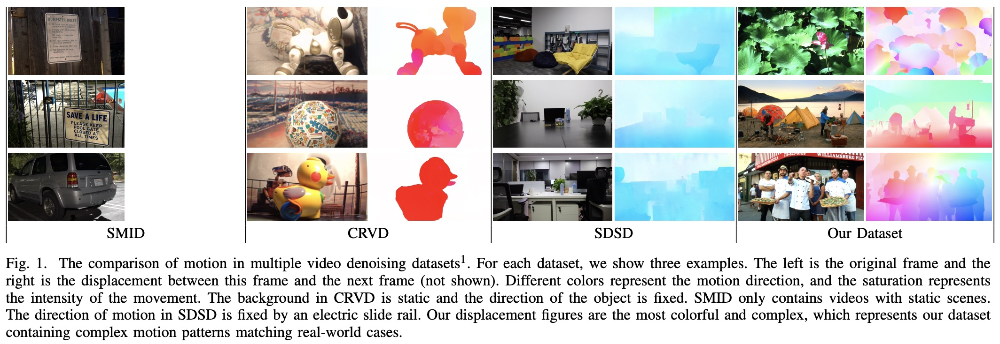
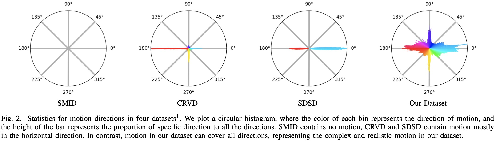
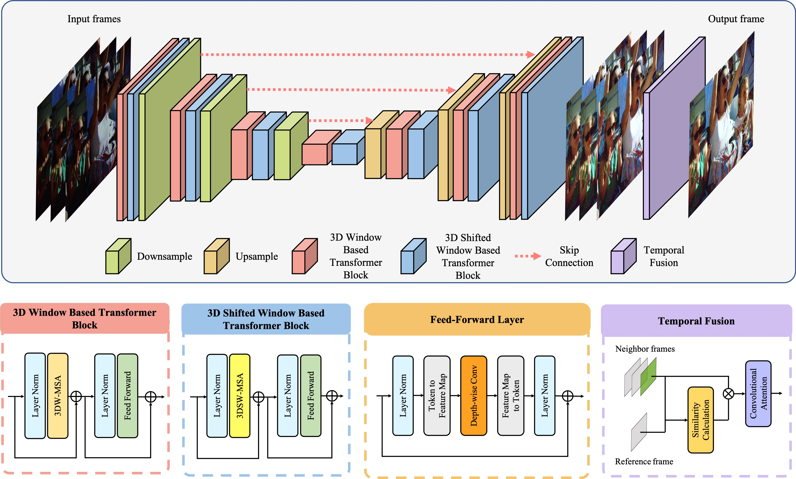

# Low-light Raw Video Denoising with a High-quality Realistic Motion Dataset (TMM2022)

This code is the PyTorch implementation of _Low-light Raw Video Denoising with a High-quality Realistic Motion Dataset_.

<hr />

> **Abstract:** *Recently, supervised deep-learning methods have shown their effectiveness on raw video denoising in low-light. However, existing training datasets have specific drawbacks, e.g., inaccurate noise modeling in synthetic datasets, simple motion created by hand or fixed motion, and limited-quality ground truth caused by the beam splitter in real captured datasets. These defects significantly decline the performance of network when tackling real low-light video sequences, where noise distribution and motion patterns are extremely complex. In this paper, we collect a raw video denoising dataset in low-light with complex motion and high-quality ground truth, overcoming the drawbacks of previous datasets. Specifically, we capture 210 paired videos, each containing short/long exposure pairs of real video frames with dynamic objects and diverse scenes displayed on a high-end monitor. Besides, since spatial self-similarity has been extensively utilized in image tasks, harnessing this property for network design is more crucial for video denoising as temporal redundancy. To effectively exploit the intrinsic temporal-spatial self-similarity of complex motion in real videos, we propose a new Transformer-based network, which can effectively combine the locality of convolution with the long-range modeling ability of 3D temporal-spatial self-attention. Extensive experiments verify the value of our dataset and the effectiveness of our method on various metrics.*
<hr />

## Dataset Motion Analysis





## Network Architecture




## Setup

### Requirements

- Python 3.7.11
- PyTorch 1.8.2
- numpy 1.21.2
- opencv 4.5.5
- scikit-image 0.16.2

## Contents

[1. Dataset](#1) 

[2. Training & Testing](#2) 

[3. Results](#3) 

[4. Acknowledgement](#4) 

[5. Citations](#5)

<p id="1"></p > 

## Dataset

### CRVD Dataset

We follow the dataset setup in RViDeNet. Please click [this link](https://github.com/cao-cong/RViDeNet) for detailed preparation description.

### Low-light Realistic Motion Video Dataset

We are arganizing the data, and it be soon uploaded.

<p id="2"></p > 

## Training & Testing

<p id="3"></p > 

## Results

<p id="4"></p > 

## Acknowledgement


<p id="5"></p>

## Citations

If you find the code helpful in your resarch or work, please cite the following paper(s).

```
@ARTICLE{10003653,
  author={Fu, Ying and Wang, Zichun and Zhang, Tao and Zhang, Jun},
  journal={IEEE Transactions on Multimedia}, 
  title={Low-light Raw Video Denoising with a High-quality Realistic Motion Dataset}, 
  year={2022},
  volume={},
  number={},
  pages={1-13},
  doi={10.1109/TMM.2022.3233247}}
```